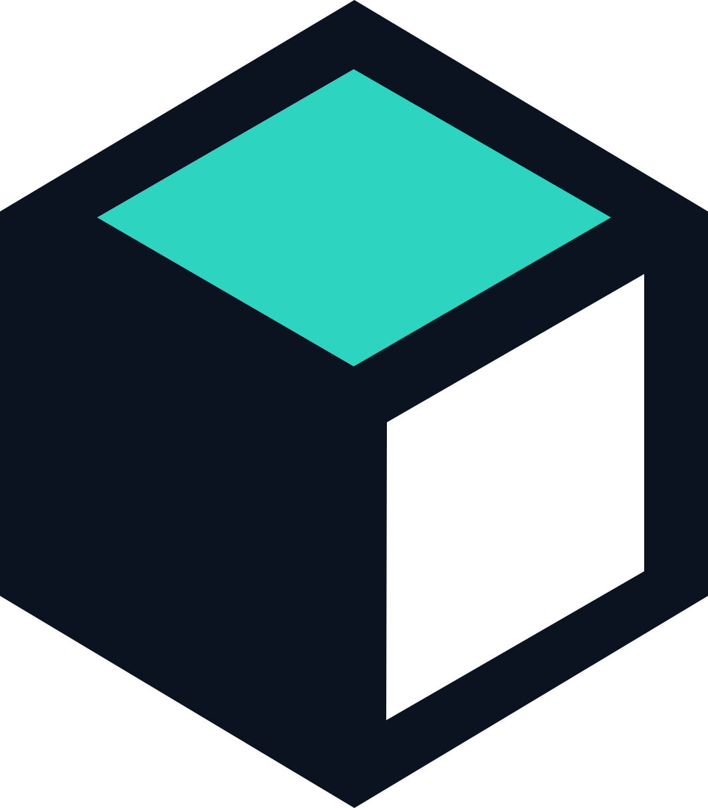

<p align="center">
  
</p>

# sceneify

Build interactive browser-based 3D worlds from Python.

`sceneify` is a PyPI library with a Streamlit-like authoring API. Python defines the scene and
game behavior, while the bundled web viewer provides view, edit, and play modes.

## Install

With uv:

```bash
uv add sceneify
```

With pip:

```bash
pip install sceneify
```

The published wheel includes the viewer. Node.js is required only when developing the viewer
itself.

## Create a world from Python or the editor

```python
import sceneify as sf

scene = sf.Scene("my-level")
scene.create_primitive(
    "ground",
    "plane",
    size=(16, 1, 16),
    material=sf.Material("#344054"),
    physics=sf.Physics(body="fixed", collider="cuboid"),
)
scene.save("world.sceneify.json")
scene.run()
```

`scene.run()` opens the world editor. It can create primitives, import GLB files, instantiate
catalog assets, edit materials and physics, organize the hierarchy, undo commands, and save a
versioned scene.

The saved level becomes the input to a game script:

```python
import sceneify as sf

scene = sf.Scene.load("world.sceneify.json")


@scene.on_event
def game_event(current: sf.Scene, event: sf.SemanticEvent) -> None:
    print(event.name, event.node_id)


scene.play()
```

## Make a Python game

Python declares the world, controls, camera, sensors, HUD, timer, and outcomes. The browser runs
latency-sensitive movement and physics, while WebSocket carries semantic events and scene edits.

```python
import sceneify as sf

scene = sf.Scene("collect")
scene.create_primitive(
    "player",
    "capsule",
    position=(0, 1, 0),
    physics=sf.Physics(body="dynamic", collider="capsule"),
)

game = sf.Game()
game.action_map(
    moveForward=["KeyW", "ArrowUp"],
    moveBack=["KeyS", "ArrowDown"],
    moveLeft=["KeyA", "ArrowLeft"],
    moveRight=["KeyD", "ArrowRight"],
    jump=["Space"],
)
game.add_controller("player")
game.follow_camera("player")
game.set_hud(title="Collect and Escape")
game.set_timer(90)
scene.set_game(game)
scene.play()
```

Run the complete third-person vertical slice with a skinned KayKit character,
animation blending, GLB dungeon props, physics, collectibles, and HUD:

```bash
uv run python examples/collect_escape.py
```

Open the same world in authoring mode:

```bash
uv run python examples/collect_escape.py --edit
```

Run the Roman-inspired environment showcase with local HDR lighting, CC0 sculptures,
curated ruins, and mouse-driven points of interest:

```bash
uv run python examples/roman_environment.py
```

Open the same environment in the authoring editor:

```bash
uv run python examples/roman_environment.py --edit
```

The Roman showcase runs an automatic camera tour along a predefined path: wide
establishing shots, travel through the plaza, and close framing of each exhibit
with lowered lighting and a stable info panel. Markers remain for hover context in
edit mode. Asset sources and licenses are listed in
[`THIRD_PARTY_ASSETS.md`](THIRD_PARTY_ASSETS.md). Demo binaries remain in the Git
repository but are excluded from the PyPI wheel and source distribution.

Anchor POIs to scene objects instead of duplicating absolute coordinates:

```python
scene.add_annotation(
    "statue_info",
    target_id="marble_bust",
    offset=(0, 2, 0),
    label="Marble Bust 01",
)
```

See [docs/protocol.md](docs/protocol.md) for synchronization and semantic events.

## Use with Gymnasium and Stable Baselines3

The optional RL extra installs Gymnasium only:

```bash
uv add "sceneify[rl]"
```

`sceneify.rl.ReachTargetEnv` trains headless and can stream a human render to the browser. Stable
Baselines3 is not a sceneify dependency. Add it to the application that needs it:

```bash
uv add stable-baselines3 "sceneify[rl]"
uv run python examples/rl_sb3_stub.py
```

## Build worlds with a coding agent

sceneify does not run a language model and does not install a model provider. It exposes a
versioned scene schema, an asset catalog, and deterministic actions. A developer's coding agent
can translate text into those actions using existing GLB assets.

```python
import sceneify as sf

scene = sf.Scene("warehouse")
catalog = sf.AssetCatalog.load("assets.catalog.json")
tools = sf.WorldTools(scene, catalog)

tools.apply({"action": "set_world", "asset": "warehouse_shell"})
tools.apply(
    {
        "action": "add_asset",
        "asset": "forklift",
        "id": "forklift_1",
        "position": [2, 0, -1],
    }
)
tools.apply({"action": "save", "path": "warehouse.sceneify.json"})
```

Run `sceneify tool-spec` to print the neutral action descriptor. See
[docs/agent-tools.md](docs/agent-tools.md), [docs/catalog.md](docs/catalog.md), and
[docs/schema.md](docs/schema.md).

The `sceneify[llm]` extra is a dependency-free compatibility marker. Agent tools ship in the core
package and remain independent from model SDKs.

## Optional extras

```bash
uv add "sceneify[mesh]"
uv add "sceneify[rl]"
uv add "sceneify[llm]"
```

* `mesh` adds local geometry processing with trimesh and NumPy
* `rl` adds the Gymnasium environment interface
* `llm` keeps a provider-neutral install target without installing model runtimes

## Examples and checks

```bash
uv run python examples/basic_scene.py
uv run python examples/world_edit_save.py
uv run python examples/collect_escape.py
uv run pytest
```

Development uses uv, Python 3.13, and the committed lockfile. See
[docs/development.md](docs/development.md).

## License

MIT. Copyright (c) 2026 Klajdi Beqiraj.
